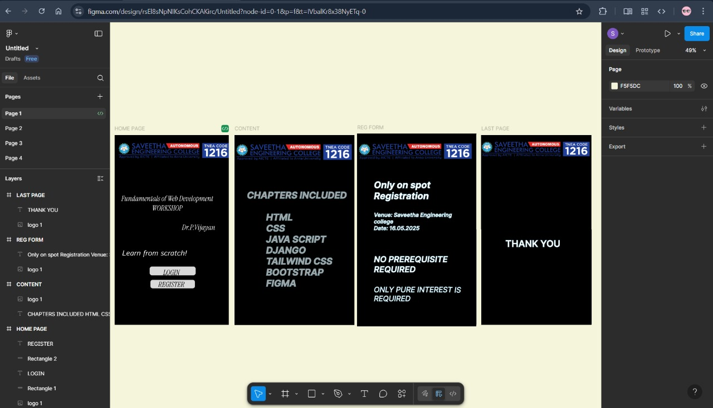

# Ex09 Event Registration Web Application
## Date:17.05.2025

## AIM:
To design, develop and deploy a web application for event registration.

## DESIGN STEPS:

### Step 1:
Create a new frame.

### Step 2:
Select any one preset size of your choice.

### Step 3:
Select the shapes you need.

### Step 4:
Import images as needed.

### Step 5:
Create pages based on your need and link them.

### Step 6:

Validate the HTML and CSS code.

### Step 6:

Publish the website in the given URL.

## DESIGN TOOL:
Figma

## CODE:
````
PAGE-1:

HTML CODE

<div style="width: 700px; height: 840px; position: relative; background: black; overflow: hidden">
  <div style="width: 200px; height: 38px; left: 222px; top: 581px; position: absolute; background: #D9D9D9; border-radius: 10px"></div>
  <div style="width: 187px; height: 26px; left: 222px; top: 593px; position: absolute; text-align: center; justify-content: flex-end; display: flex; flex-direction: column; color: black; font-size: 32px; font-family: Instrument Serif; font-style: italic; font-weight: 400; word-wrap: break-word">LOGIN</div>
  <div style="width: 194px; height: 37px; left: 228px; top: 630px; position: absolute; background: #D9D9D9; border-radius: 10px"></div>
  <div style="width: 147px; height: 24px; left: 262px; top: 643px; position: absolute; text-align: center; justify-content: flex-end; display: flex; flex-direction: column; color: black; font-size: 32px; font-family: Instrument Serif; font-style: italic; font-weight: 400; word-wrap: break-word">REGISTER</div>
  <div style="width: 607px; height: 192px; left: 32px; top: 244px; position: absolute; text-align: center; justify-content: flex-end; display: flex; flex-direction: column; color: white; font-size: 32px; font-family: Instrument Serif; font-style: italic; font-weight: 400; word-wrap: break-word">Fundamentals of Web Development<br/>WORKSHOP<br/><br/>                                                  Dr.P.Vijayan</div>
  <div style="width: 646px; height: 79px; left: -150px; top: 461px; position: absolute; text-align: center; justify-content: flex-end; display: flex; flex-direction: column; color: white; font-size: 32px; font-family: Istok Web; font-style: italic; font-weight: 400; word-wrap: break-word">Learn from scratch!</div>
</div>

CSS CODE

import React from "react";
import styled from "styled-components";

const StyledRectangle1 = styled.div`
  width: 200px;
  height: 38px;
  left: 222px;
  top: 581px;
  position: absolute;
  background: #D9D9D9;
  border-radius: 10px;
`;

const StyledLoginspan = styled.span`
  color: black;
  font-size: 32px;
  font-family: Instrument Serif;
  font-style: italic;
  font-weight: 400;
  word-wrap: break-word;
`;

const StyledRectangle2 = styled.div`
  width: 194px;
  height: 37px;
  left: 228px;
  top: 630px;
  position: absolute;
  background: #D9D9D9;
  border-radius: 10px;
`;

const StyledRegisterspan = styled.span`
  color: black;
  font-size: 32px;
  font-family: Instrument Serif;
  font-style: italic;
  font-weight: 400;
  word-wrap: break-word;
`;

const StyledFundamentalsofwebdevelopmentworkshopdrpvijayanspan = styled.span`
  color: white;
  font-size: 32px;
  font-family: Instrument Serif;
  font-style: italic;
  font-weight: 400;
  word-wrap: break-word;
`;

const StyledLearnfromscratchspan = styled.span`
  color: white;
  font-size: 32px;
  font-family: Istok Web;
  font-style: italic;
  font-weight: 400;
  word-wrap: break-word;
`;

const StyledAndroidMedium1 = styled.div`
  width: 700px;
  height: 840px;
  position: relative;
  background: black;
  overflow: hidden;
`;

export const AndroidMedium1 = () => {
  return (
    <StyledAndroidMedium1>
      <StyledRectangle1 />
      <StyledLOGIN>LOGIN</StyledLOGIN>
      <StyledRectangle2 />
      <StyledREGISTER>REGISTER</StyledREGISTER>
      <StyledFundamentalsofWebDevelopmentWORKSHOPDrPVijayan>Fundamentals of Web Development<br/>WORKSHOP<br/><br/>                                                  Dr.P.Vijayan</StyledFundamentalsofWebDevelopmentWORKSHOPDrPVijayan>
      <StyledLearnfromscratch>Learn from scratch!</StyledLearnfromscratch>
    </StyledAndroidMedium1>
  );
};

PAGE-2

HTML

<div style="width: 700px; height: 840px; position: relative; background: black; overflow: hidden">
  <div style="width: 630px; height: 597px; left: 63px; top: 219px; position: absolute; color: rgba(0, 0, 0, 0.20); font-size: 40px; font-family: Inter; font-style: italic; font-weight: 700; word-wrap: break-word; text-shadow: 0px 4px 4px rgba(0, 0, 0, 0.25)">CHAPTERS INCLUDED<br/><br/>         HTML<br/>         CSS<br/>         JAVA SCRIPT<br/>         DJANGO <br/>         TAILWIND CSS<br/>         BOOTSTRAP<br/>         FIGMA<br/>         </div>
</div>

CSS

import React from "react";
import styled from "styled-components";

const StyledChaptersincludedhtmlcssjavascriptdjangotailwindcssbootstrapfigmaspan = styled.span`
  color: rgba(0, 0, 0, 0.20);
  font-size: 40px;
  font-family: Inter;
  font-style: italic;
  font-weight: 700;
  word-wrap: break-word;
  text-shadow: 0px 4px 4px rgba(0, 0, 0, 0.25);
`;

const StyledAndroidMedium1 = styled.div`
  width: 700px;
  height: 840px;
  position: relative;
  background: black;
  overflow: hidden;
`;

export const AndroidMedium1 = () => {
  return (
    <StyledAndroidMedium1>
      <StyledCHAPTERSINCLUDEDHTMLCSSJAVASCRIPTDJANGOTAILWINDCSSBOOTSTRAPFIGMA>CHAPTERS INCLUDED<br/><br/>         HTML<br/>         CSS<br/>         JAVA SCRIPT<br/>         DJANGO <br/>         TAILWIND CSS<br/>         BOOTSTRAP<br/>         FIGMA<br/>         </StyledCHAPTERSINCLUDEDHTMLCSSJAVASCRIPTDJANGOTAILWINDCSSBOOTSTRAPFIGMA>
    </StyledAndroidMedium1>
  );
};

PAGE-3

HTML

<div style="width: 700px; height: 840px; position: relative; background: black; overflow: hidden">
  <div style="width: 605px; height: 602px; left: 51px; top: 175px; position: absolute"><span style="color: white; font-size: 40px; font-family: Inter; font-style: italic; font-weight: 700; word-wrap: break-word"><br/>Only on spot Registration<br/><br/></span><span style="color: white; font-size: 24px; font-family: Inter; font-style: italic; font-weight: 600; word-wrap: break-word">Venue: Saveetha Engineering college<br/>Date: 16.05.2025<br/></span><span style="color: white; font-size: 40px; font-family: Inter; font-style: italic; font-weight: 700; word-wrap: break-word"><br/><br/></span><span style="color: white; font-size: 36px; font-family: Inter; font-style: italic; font-weight: 600; word-wrap: break-word">NO PREREQUISITE REQUIRED<br/></span><span style="color: white; font-size: 40px; font-family: Inter; font-style: italic; font-weight: 700; word-wrap: break-word"><br/></span><span style="color: white; font-size: 32px; font-family: Inter; font-style: italic; font-weight: 400; word-wrap: break-word">ONLY PURE INTEREST IS REQUIRED<br/></span><span style="color: white; font-size: 40px; font-family: Inter; font-style: italic; font-weight: 700; word-wrap: break-word"><br/> <br/></span></div>
</div>

CSS

import React from "react";
import styled from "styled-components";

const StyledOnlyonspotregistrationvenuesaveethaengineeringcollegedate16052025noprerequisiterequiredonlypureinterestisrequiredspan01 = styled.span`
  color: white;
  font-size: 40px;
  font-family: Inter;
  font-style: italic;
  font-weight: 700;
  word-wrap: break-word;
`;

const StyledOnlyonspotregistrationvenuesaveethaengineeringcollegedate16052025noprerequisiterequiredonlypureinterestisrequiredspan02 = styled.span`
  color: white;
  font-size: 24px;
  font-family: Inter;
  font-style: italic;
  font-weight: 600;
  word-wrap: break-word;
`;

const StyledOnlyonspotregistrationvenuesaveethaengineeringcollegedate16052025noprerequisiterequiredonlypureinterestisrequiredspan03 = styled.span`
  color: white;
  font-size: 40px;
  font-family: Inter;
  font-style: italic;
  font-weight: 700;
  word-wrap: break-word;
`;

const StyledOnlyonspotregistrationvenuesaveethaengineeringcollegedate16052025noprerequisiterequiredonlypureinterestisrequiredspan04 = styled.span`
  color: white;
  font-size: 36px;
  font-family: Inter;
  font-style: italic;
  font-weight: 600;
  word-wrap: break-word;
`;

const StyledOnlyonspotregistrationvenuesaveethaengineeringcollegedate16052025noprerequisiterequiredonlypureinterestisrequiredspan05 = styled.span`
  color: white;
  font-size: 40px;
  font-family: Inter;
  font-style: italic;
  font-weight: 700;
  word-wrap: break-word;
`;

const StyledOnlyonspotregistrationvenuesaveethaengineeringcollegedate16052025noprerequisiterequiredonlypureinterestisrequiredspan06 = styled.span`
  color: white;
  font-size: 32px;
  font-family: Inter;
  font-style: italic;
  font-weight: 400;
  word-wrap: break-word;
`;

const StyledOnlyonspotregistrationvenuesaveethaengineeringcollegedate16052025noprerequisiterequiredonlypureinterestisrequiredspan07 = styled.span`
  color: white;
  font-size: 40px;
  font-family: Inter;
  font-style: italic;
  font-weight: 700;
  word-wrap: break-word;
`;

const StyledAndroidMedium1 = styled.div`
  width: 700px;
  height: 840px;
  position: relative;
  background: black;
  overflow: hidden;
`;

export const AndroidMedium1 = () => {
  return (
    <StyledAndroidMedium1>
      <StyledOnlyonspotRegistrationVenueSaveethaEngineeringcollegeDate16052025NOPREREQUISITEREQUIREDONLYPUREINTERESTISREQUIRED><StyledOnlyonspotregistrationvenuesaveethaengineeringcollegedate16052025noprerequisiterequiredonlypureinterestisrequiredspan01><br/>Only on spot Registration<br/><br/></StyledOnlyonspotregistrationvenuesaveethaengineeringcollegedate16052025noprerequisiterequiredonlypureinterestisrequiredspan01><StyledOnlyonspotregistrationvenuesaveethaengineeringcollegedate16052025noprerequisiterequiredonlypureinterestisrequiredspan02>Venue: Saveetha Engineering college<br/>Date: 16.05.2025<br/></StyledOnlyonspotregistrationvenuesaveethaengineeringcollegedate16052025noprerequisiterequiredonlypureinterestisrequiredspan02><StyledOnlyonspotregistrationvenuesaveethaengineeringcollegedate16052025noprerequisiterequiredonlypureinterestisrequiredspan03><br/><br/></StyledOnlyonspotregistrationvenuesaveethaengineeringcollegedate16052025noprerequisiterequiredonlypureinterestisrequiredspan03><StyledOnlyonspotregistrationvenuesaveethaengineeringcollegedate16052025noprerequisiterequiredonlypureinterestisrequiredspan04>NO PREREQUISITE REQUIRED<br/></StyledOnlyonspotregistrationvenuesaveethaengineeringcollegedate16052025noprerequisiterequiredonlypureinterestisrequiredspan04><StyledOnlyonspotregistrationvenuesaveethaengineeringcollegedate16052025noprerequisiterequiredonlypureinterestisrequiredspan05><br/></StyledOnlyonspotregistrationvenuesaveethaengineeringcollegedate16052025noprerequisiterequiredonlypureinterestisrequiredspan05><StyledOnlyonspotregistrationvenuesaveethaengineeringcollegedate16052025noprerequisiterequiredonlypureinterestisrequiredspan06>ONLY PURE INTEREST IS REQUIRED<br/></StyledOnlyonspotregistrationvenuesaveethaengineeringcollegedate16052025noprerequisiterequiredonlypureinterestisrequiredspan06><StyledOnlyonspotregistrationvenuesaveethaengineeringcollegedate16052025noprerequisiterequiredonlypureinterestisrequiredspan07><br/> <br/></StyledOnlyonspotregistrationvenuesaveethaengineeringcollegedate16052025noprerequisiterequiredonlypureinterestisrequiredspan07></StyledOnlyonspotRegistrationVenueSaveethaEngineeringcollegeDate16052025NOPREREQUISITEREQUIREDONLYPUREINTERESTISREQUIRED>
    </StyledAndroidMedium1>
  );
};

PAGE-4

HTML

<div style="width: 700px; height: 840px; position: relative; background: black; overflow: hidden">
  <div style="width: 605px; height: 602px; left: 51px; top: 175px; position: absolute; text-align: center; justify-content: center; display: flex; flex-direction: column"><span style="color: white; font-size: 40px; font-family: Inter; font-style: italic; font-weight: 700; word-wrap: break-word"><br/></span><span style="color: white; font-size: 40px; font-family: Inter; font-style: italic; font-weight: 600; word-wrap: break-word">THANK YOU</span></div>
</div>

CSS

import React from "react";
import styled from "styled-components";

const StyledThankyouspan01 = styled.span`
  color: white;
  font-size: 40px;
  font-family: Inter;
  font-style: italic;
  font-weight: 700;
  word-wrap: break-word;
`;

const StyledThankyouspan02 = styled.span`
  color: white;
  font-size: 40px;
  font-family: Inter;
  font-style: italic;
  font-weight: 600;
  word-wrap: break-word;
`;

const StyledAndroidMedium1 = styled.div`
  width: 700px;
  height: 840px;
  position: relative;
  background: black;
  overflow: hidden;
`;

export const AndroidMedium1 = () => {
  return (
    <StyledAndroidMedium1>
      <StyledTHANKYOU><StyledThankyouspan01><br/></StyledThankyouspan01><StyledThankyouspan02>THANK YOU</StyledThankyouspan02></StyledTHANKYOU>
    </StyledAndroidMedium1>
  );
};

````

## OUTPUT:



## RESULT:
The program to design, develop and deploy a web application for event registration is completed successfully.
